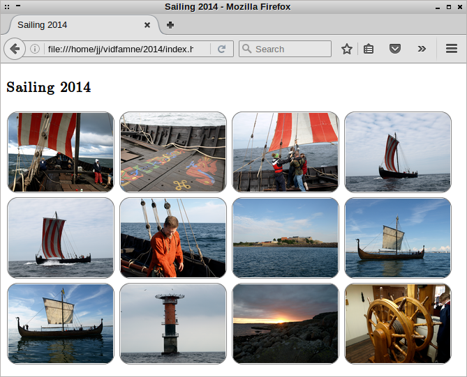

# Gallery Creator

## About
A small bash script to create HTML image galleries. Given a directory, it will find all images in it and resize them to smaller thumbnails. The thumbnails will have borders with rounded corners. A HTML gallery is created as well.

Any *.css files that are in the same directory as the Gallery Creator script will be copied into the gallery directory and used in the generated HTML file. If there is a directory called "fonts" in the same directory as the Gallery Creator script, it will also be copied to the gallery.

The script is written in Bash and depends on Image Magick.

## Usage
`./gallerycreator.sh <PATH> <GALLERY_NAME>`

Example:

`./gallerycreator.sh ~/images/italy \"Trip to Italy\"`

Will create thumbnails in a subfolder to <PATH> called 'thumbs'. A HTML gallery with the title <GALLERY_NAME> will be created.

## Author
Written by Johan Sjöblom in 2016.

## License
Public domain
